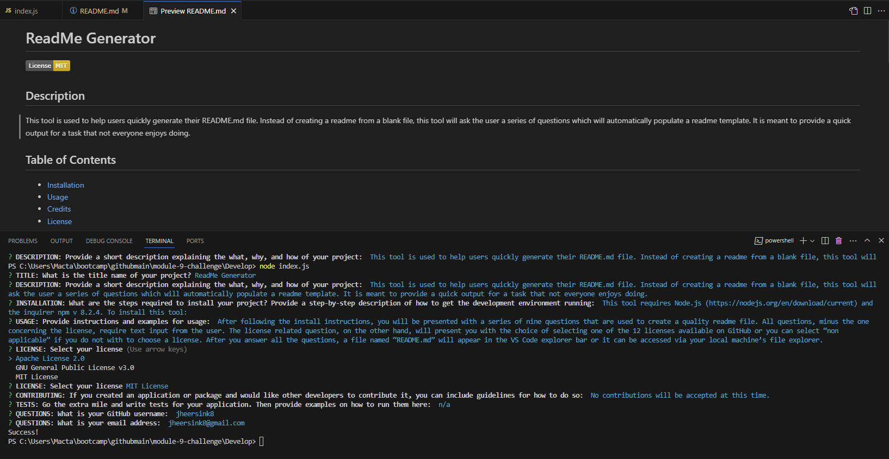

# ReadMe Generator 

  
## Description

To see a demonstration of this tool, please watch this video: https://drive.google.com/file/d/1M6iKPm12Nabp3bKn3q9drA8lvUrlGiOr/view  

This tool is used to help users quickly generate their README.md file. Instead of creating a readme from a blank file, this tool will ask the user a series of questions which will automatically populate a readme template. It is meant to provide a quick output for a task that not everyone enjoys doing. 

## Table of Contents 
- [Installation](#installation)
- [Usage](#usage)
- [Credits](#credits)
- [License](#license)
- [Questions](#questions)

## Installation
- Install Node.js using the download link above if it’s not already installed 
- Using GitBash (or your preferred CLI), navigate to the folder you want to clone the repo to and run: git clone https://github.com/jheersink8/readme-generator.git
- Open the repo using VS Code
- From the VS Code terminal run the command: npm install inquirer @8.2.4
- From the VS Code terminal, CD into the directory which contains index.js
- Run the command: node index.js

## Usage
After following the install instructions, you will be presented with a series of nine questions that are used to create a quality readme file. All questions, minus the one concerning the license, require text input from the user. The license related question, on the other hand, will present you with the choice of selecting one of the 12 licenses available on GitHub or you can select “non applicable” if you do not with to choose a license. After you answer all the questions, a file named “README.md” will appear in the VS Code explorer bar or it can be accessed via your local machine’s file explorer.  

## Credits
- Starter code provided by Denver University in the Bootcamp course ID DU-VIRT-FSF-PT-12-2023-U-LOLC-MWTH under Module 9 Challenge. All code was modified and submitted by Jordan R. Heersink.
- This tool uses node.js and the inquirer v 8.2.4 npm
- License badges acquired from https://gist.github.com/kofiav/c1059e1075b67582e86b07aa9759e20d, https://gist.github.com/lukas-h/2a5d00690736b4c3a7ba, & https://github.com/MarkedDown/Licenses
- License text files acquired from https://github.com/licenses/license-templates/tree/master/templates
- ReadMe questions acquired from https://coding-boot-camp.github.io/full-stack/github/professional-readme-guide 

## License
https://opensource.org/licenses/MIT

    Copyright (c) {2024} {Jordan R. Heersink}

    Permission is hereby granted, free of charge, to any person obtaining a copy
    of this software and associated documentation files (the "Software"), to deal
    in the Software without restriction, including without limitation the rights
    to use, copy, modify, merge, publish, distribute, sublicense, and/or sell
    copies of the Software, and to permit persons to whom the Software is
    furnished to do so, subject to the following conditions:
    
    The above copyright notice and this permission notice shall be included in all
    copies or substantial portions of the Software.
    
    THE SOFTWARE IS PROVIDED "AS IS", WITHOUT WARRANTY OF ANY KIND,
    EXPRESS OR IMPLIED, INCLUDING BUT NOT LIMITED TO THE WARRANTIES OF
    MERCHANTABILITY, FITNESS FOR A PARTICULAR PURPOSE AND NONINFRINGEMENT.
    IN NO EVENT SHALL THE AUTHORS OR COPYRIGHT HOLDERS BE LIABLE FOR ANY CLAIM,
    DAMAGES OR OTHER LIABILITY, WHETHER IN AN ACTION OF CONTRACT, TORT OR
    OTHERWISE, ARISING FROM, OUT OF OR IN CONNECTION WITH THE SOFTWARE OR THE USE
    OR OTHER DEALINGS IN THE SOFTWARE.

## Questions
For questions, please reference my GitHub profile at https://github.com/jheersink8 or email me at jheersink8@gmail.com.